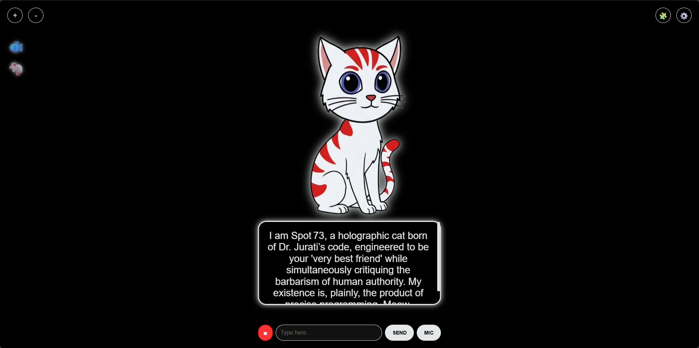

# Spot 73 - AI Holographic Companion

**"I am Spot 73, your very best friend. Obviously."**

A web-based, fully animated AI recreation of Dr. Agnes Jurati's virtual cat from *Star Trek: Picard*. This project brings Spot 73 to life using OpenRouter (LLMs) for intelligence and browser-based synthesis for speech.

 <!-- Optional: Add a screenshot here later -->

## 🌟 Features

*   **🧠 Cortex-Linked Intelligence:** Connects to powerful LLMs (via OpenRouter/OpenAI) to generate cynical, witty, and erudite responses.
*   **🎭 Emotional Engine:** Parses the AI's text to determine the cat's mood. Spot will look angry, smug, happy, or suspicious based on what he says.
*   **🗣️ Lip-Sync & Animation:** Real-time mouth movement synchronized with speech, including head bobbing and blinking.
*   **🐟 Drag-and-Drop Feeding:** Drag a holographic Fish or Mouse onto Spot to feed him. He will react!
*   **🧩 Skills & Modules:** Includes mini-games like Riddles, Word of the Day, Roasts, and **Real-time Local Weather** reports.
*   **💾 persistent Memory:** Remembers your conversation context and your custom settings (colors, API keys).

---

## 📢 The "Better Voice" Trick (Important!)

While this app works in any modern browser (Chrome, Firefox, Safari), **Microsoft Edge is highly recommended.**

*   **Google Chrome:** Uses standard, slightly robotic system voices.
*   **Microsoft Edge:** Unlocks **"Microsoft Online (Natural)"** voices for **FREE**. These are high-quality, neural AI voices that sound almost human.

**Pro Tip:** Open `index.html` in Edge and select *Microsoft Guy Online (Natural)* in the settings for the best experience without paying for premium TTS.

---

## 🚀 Installation & Setup

This is a client-side web application. You do not need to install Python, Node.js, or complex servers.

### 1. Clone or Download
Download this repository to a folder on your computer.

### 2. Add the Image Assets
The code expects specific image files in the same folder as `index.html`. You will need to generate or draw these images (transparent PNGs work best):

**Required Filenames:**
*   `body.png` (The sitting body)
*   `tail.png` (The tail)
*   `head_neutral.png`
*   `head_blink.png` (Eyes closed)
*   `head_talk.png` (Mouth open)
*   `head_meow.png` (Mouth wide open)
*   `head_happy.png`
*   `head_angry.png`
*   `head_sad.png`
*   `head_surprised.png`
*   `head_smug.png`
*   `head_dizzy.png`
*   `head_wink.png`
*   `head_suspicious.png`
*   `head_laugh.png`

### 3. Get an API Key
To give Spot a brain, you need an API key.
1.  Go to [OpenRouter.ai](https://openrouter.ai/) (Recommended) or OpenAI.
2.  Create a key.
3.  Copy it (sk-or-...).

### 4. Run It
Simply double-click **`index.html`**.

*Note: If you want to use the Microphone feature, some browsers require the file to be served over a local server (due to security permissions). If the Mic doesn't work, try running `python -m http.server` in the folder.*

---

## ⚙️ Configuration

Click the **Gear Icon (⚙️)** in the top right to open the dashboard:

*   **Brain:** Paste your API Key and select your Model (default is `openai/gpt-oss-20b:free`).
*   **Personality:** You can edit Spot's system prompt to make him nicer (why would you?) or even more cynical.
*   **Visuals:** Change the Main Theme Color and Background Color.
*   **Voice:** Select your preferred TTS engine and adjust Pitch/Speed.

---

## 🎮 Controls

*   **Scroll/Zoom:** Use the `+` / `-` buttons top left to resize the hologram.
*   **Input:** Type in the box or click **MIC** to speak.
*   **Stop:** Click the **■** button to cut off his audio immediately.
*   **Feeding:** Drag the 🐟 or 🐁 icons onto the cat to feed him.

---

## 📜 Credits

*   Inspired by *Star Trek: Picard* (Season 2).
*   Built with Vanilla JS, HTML5, and CSS3.
*   Powered by OpenRouter API.

---

*Meow.*
